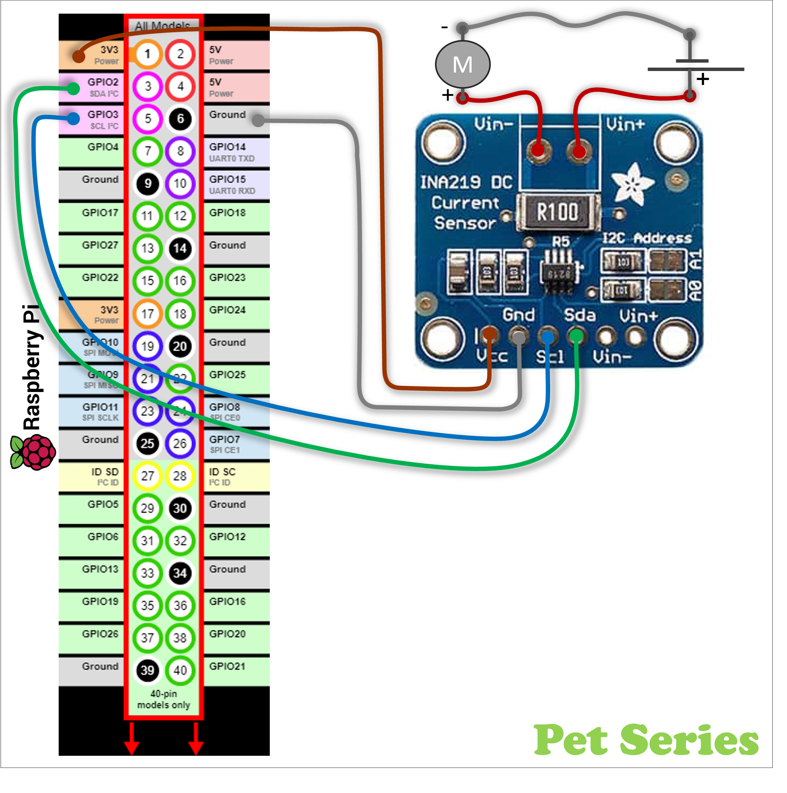

# pet_ros2_currentsensor_ina219_pkg
ROS2-publisher for the Current/Voltage sensor INA219. Publish measurement as ROS2-topics.

**Input:** Current&Voltage shount on a I2C-INA219 sensor-breakout-board. \
**Output:** ROS node (ROS2) that publish topics with voltage & current values.

<table>
    <td>
        
    </td>
    <td>
        ..
    </td>
  </table>

# ROS2 Package/Module Behaviour

# Prerequisite: Hardware
* Single Board Computer(SBC): Raspberry Pi 3/4
* Sensor: INA2129 Current Sensor via default I2C adr.=<code>0x4o</code>

# Prerequisite: Software
* Ubuntu 20.04 (64bit) or newer
* Robot Operating System 2, ROS2 (Version Galactic)
  <blockquote>...do the ROS2-installation stuff...</blockquote>

## Prerequisite: I2C-interface Raspberry Pi 4 / Ubuntu
Prepared by adding additional, i2c communication, Linux-software-packages <br/>
`Ubuntu Shell`
```
~$ sudo apt install i2c-tools
~$ sudo apt install python3-pip
~$ sudo pip3 install adafruit-blinka
~$ sudo pip3 install adafruit-circuitpython-ina219
~$ sudo i2cdetect -y 1
        0  1  2  3  4  5  6  7  8  9  a  b  c  d  e  f
   00:          -- -- -- -- -- -- -- -- -- -- -- -- -- 
   10: -- -- -- -- -- -- -- -- -- -- -- -- -- -- -- -- 
   20: -- -- -- -- -- -- -- -- -- -- -- -- -- -- -- -- 
   30: -- -- -- -- -- -- -- -- -- -- -- -- -- -- -- -- 
   40: 40 -- -- -- -- -- -- -- -- -- -- -- -- -- -- -- 
   50: -- -- -- -- -- -- -- -- -- -- -- -- -- -- -- -- 
   60: -- -- -- -- -- -- -- -- -- -- -- -- -- -- -- -- 
   70: -- -- -- -- -- -- -- --    
$ sudo chmod a+rw /dev/i2c-1
```

## Dowload and install this ROS2 packages
Create a ROS2 workspace (in my exampel '~/ws_ros2/') \
Dowload ROS2 package by using 'git clone'
<ul><blockquote>🤔There is probably better tutorials how to do this...<br/>
                ...but here is how I made it.<br/>
</blockquote></ul>

`Ubuntu Shell`
```
~$ mkdir -p ~/ws_ros2/src
~$ cd ~/ws_ros2/src
~/ws_ros2/src$ git clone https://github.com/Pet-Series/pet_ros2_currentsensor_ina219_pkg.git
~/ws_ros2/src$ cd ..
~/ws_ros2$ colcon build --symlink-install
~/ws_ros2$ source /opt/ros/galactic/setup.bash
~/ws_ros2$ source ./install/setup.bash
```

# ROS2 Launch sequence
`Ubuntu Shell #1`
```
$ ros2 run pet_ros2_battery_state_pkg pet_battery_state_ina219_node  
    [INFO] [1649019010.401689937] [pet_current_sensor_node]: INA219 Current/Voltage sensor. Config register: 
    [INFO] [1649019010.404738606] [pet_current_sensor_node]:  - bus_voltage_range:    0x1
    [INFO] [1649019010.407764240] [pet_current_sensor_node]:  - gain:                 0x3
    [INFO] [1649019010.410825520] [pet_current_sensor_node]:  - bus_adc_resolution:   0x3
    [INFO] [1649019010.413920782] [pet_current_sensor_node]:  - shunt_adc_resolution: 0x3
    [INFO] [1649019010.417161487] [pet_current_sensor_node]:  - mode:                 0x7
    [INFO] [1649019010.420058696] [pet_current_sensor_node]: ....  
```

`Ubuntu Shell #2`
```
$ ros2 topic echo /battery_status 
    header:
      stamp:
        sec: 1649019055
        nanosec: 523441553
      frame_id: 18650 3S x1P main battery
    voltage: 11.143999981880188
    temperature: .nan
    current: 0.820000000040233135
    charge: .nan
    capacity: .nan
    design_capacity: .nan
    percentage: .nan
    power_supply_status: 0
    power_supply_health: 0
    power_supply_technology: 2
    present: true
    cell_voltage: []
    cell_temperature: []
    location: Think "Inside the box"
    serial_number: '0000000'
    --- 
```
